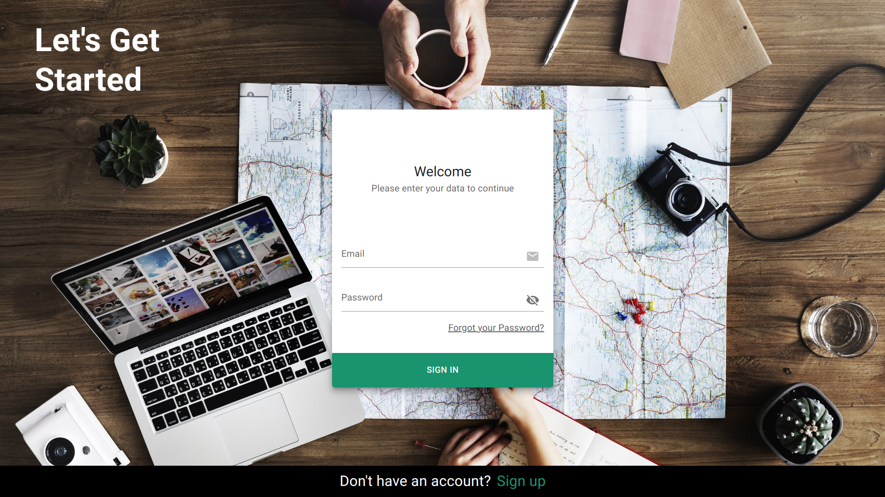

# Take a Fly
Welcome to Take A Fly, a Travel Destination Search Platform! This platform allows users to search for travel destinations based on specific criteria such as date, budget, and interests. Users can create travel plans and choose whether they want them to be public or private. If a travel plan is public, other registered users can view and join the travel if their interests align and the dates are compatible.


## Table of Contents
- [Usage](#usage)
- [Prerequisites](#prerequisites)
- [Installation](#installation)
- [Authors](#authors)
- [Technologies Used](#technologies-used)
- [Contributing](#contributing)
- [Project Link](#project-link)
- [License](#license)
- [Web Preview](#web-preview)


## Usage
1. Register an account or log in if you already have one.
2. After logging in, you will be redirected to the dashboard.
3. On the dashboard, you will find a list of public travels created by other users.
4. Use the filters provided to narrow down the search results based on categories, origin airport, departure date, or budget.
5. Click on a travel plan to view its details and decide if you want to join.
6. You can also edit your profile information or create a new travel plan.
7. When creating a travel plan, you can filter destinations based on categories and view a profile of each destination for more information.

## Prerequisites
To run this application, make sure you have the back-end of the app:
```
https://github.com/gcarolina03/takeAFly-backend
```

Start the backend server with the following command: **`npm start`**

## Installation
To install and run the front-end app locally, follow these steps:

1. Clone this repository to your local machine.
2. Navigate to the project's root directory and install the necessary dependencies by running the following command: **`npm i`**
3. Create a **`.env`** file based on the provided **`.env.example`** file. Specify the values for the environment variables required by the application to work.
4. Once the installation is complete, start the development server with the following command: **`npm run dev`**

After completing these steps, you should have both the front-end and backend of the Take A Fly app up and running locally.

5. Open your web browser and visit **`http://localhost:5173`** to access the app.

## Authors
Take a Fly was created by:

- Carolina (https://github.com/gcarolina03)
- Ainara (https://github.com/ainiesh)
- Juan (https://github.com/JB-Aguilar)


## Technologies Used
The Take A Fly Travel Destination Search Platform utilizes the following technologies:

- **React**: A popular JavaScript library for building user interfaces.
- **Material-UI**: A UI component library for React that provides pre-designed, customizable components following the Material Design guidelines.
- **Axios**: A JavaScript library used to make HTTP requests from the front-end to the backend server and connect to the database.

These technologies were chosen for their capabilities and advantages in building a modern, responsive, and interactive user interface, as well as facilitating data retrieval and communication with the backend.


## Contributing
If you would like to contribute to Take a Fly, please submit a pull request with your changes. We welcome contributions of all kinds, including bug fixes, feature additions, and general improvements.


## Project Link
You can find the project on GitHub at: https://github.com/gcarolina03/takeAFly-frontend


## License
This project is licensed under the [MIT License](LICENSE).

## Web Preview
